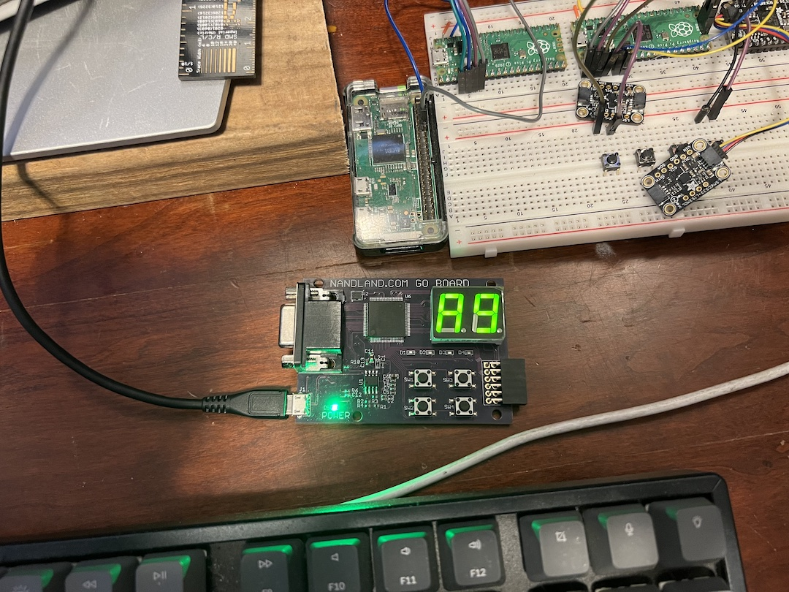

# ARM Single Cycle processor from Digital Design and Computer Architecture ARM Edition

This is a SystemVerilog project heavily based off the single cycle arm processor in the book: [DD&CA ARM Edition](https://www.amazon.com/Digital-Design-Computer-Architecture-ARM/dp/0128000562/)

## Goal
My goal is to have the three versions (single cycle / multi cycle / pipelined) of the ARM processor described in the DD&CA book working on a couple different fpga dev boards that I have.  

## FPGA Boards
The main board that I have been using is a go-board from [nandland.com](https://nandland.com/the-go-board/).  Nandland has a very affordable board to get started with fpga and a lot of great tutorials and hdl information.  The synthesis and implementation tools im using with the go-board are from [oss-cad-suite](https://github.com/YosysHQ/oss-cad-suite-build), they're open source, work with Makefiles and are very easy to learn.  I have generated a bit-steam and programmed a de0nano board through quartus prime lite with the single cycle code as well, but I don't like to use windows as much as mac / linux, so the de0nano doesn't get used very much.  Recently I've picked up an [arty-a7](https://digilent.com/shop/arty-a7-artix-7-fpga-development-board/) from digilent as well as a [arty-z7](https://digilent.com/shop/arty-z7-zynq-7000-soc-development-board/) to practice learning Vivado & Vitus with.  I have the arm single cycle working on the arty-a7 as well and will put the build files here.

## About the ARM Single Cycle
The book says that a computer architecture is defined by its instruction set and architectural state.   The architectural state for the ARM processor consistes of 16 32-bit registers and a status register.  We're also using a 32 bit wide memory address as well as 32 bit wide memory data.

At the time of this writing we only have a few instructions and as I add more i'll try to remember to update this readme.
#### Data Processing:
* ADD
* SUB
* AND
* ORR
#### Memory Instructions:
* LDR
* STR
#### Branches:
* B

## Flash ARM single cycle to go-board
I have a simple count program that I ported over to the arm after seeing Xark run it on his SystemVerilog version of [Ben Eaters 8-bit CPU](https://github.com/XarkLabs/BenEaterSV).  It simply counts up in hex and displays on the go-board 7-segment displays.  To build it just cd into the goboard directory, make, make prog:
```
nick@MacBook-Pro arm_single_cycle % cd goboard 
nick@MacBook-Pro goboard % make
=== Synthesizing FPGA design ===
verilator --lint-only -sv --language 1800-2012 --trace-fst -v /Users/nick/.bin/oss-cad-suite/share/yosys/ice40/cells_sim.v -I../rtl -Wall -Wno-DECLFILENAME  -DNO_ICE40_DEFAULT_ASSIGNMENTS --top-module cpusys_goboard ice40_config.vlt cpusys_goboard.sv goboard_7seg.sv ../rtl/adder.sv ../rtl/alu.sv ../rtl/arm.sv ../rtl/condcheck.sv ../rtl/condlogic.sv ../rtl/controller.sv ../rtl/cpu_main.sv ../rtl/datapath.sv ../rtl/decoder.sv ../rtl/dmem.sv ../rtl/extend.sv ../rtl/flopenr.sv ../rtl/flopr.sv ../rtl/imem.sv ../rtl/mux2.sv ../rtl/regfile.sv ../rtl/shifter.sv 2>&1 | tee logs/cpusys_goboard_verilator.log
yosys -e "no driver" -l logs/cpusys_goboard_yosys.log -q -p 'verilog_defines  -DNO_ICE40_DEFAULT_ASSIGNMENTS ; read_verilog -sv -I../rtl cpusys_goboard.sv goboard_7seg.sv ../rtl/adder.sv ../rtl/alu.sv ../rtl/arm.sv ../rtl/condcheck.sv ../rtl/condlogic.sv ../rtl/controller.sv ../rtl/cpu_main.sv ../rtl/datapath.sv ../rtl/decoder.sv ../rtl/dmem.sv ../rtl/extend.sv ../rtl/flopenr.sv ../rtl/flopr.sv ../rtl/imem.sv ../rtl/mux2.sv ../rtl/regfile.sv ../rtl/shifter.sv ; synth_ice40 -device u -json cpusys_goboard.json'
=== Routing FPGA design ===
nextpnr-ice40 -l logs/cpusys_goboard_nextpnr.log -q --placer heap --promote-logic --opt-timing --hx1k --package vq100 --json cpusys_goboard.json --pcf goboard.pcf --asc cpusys_goboard.asc
icepack cpusys_goboard.asc cpusys_goboard.bin
=== Synthesis stats for cpusys_goboard on hx1k ===
Package: oss-cad-suite-darwin-arm64-20220729
Yosys 0.19+36 (git sha1 30a4218f5, aarch64-apple-darwin20.2-clang 10.0.0-4ubuntu1 -fPIC -Os)
nextpnr-ice40 -- Next Generation Place and Route (Version nextpnr-0.3-69-g1b54fa2a)
Info: Device utilisation:
Info:            ICESTORM_LC:   573/ 1280    44%
Info:           ICESTORM_RAM:     1/   16     6%
Info:                  SB_IO:    20/  112    17%
Info:                  SB_GB:     8/    8   100%

Info: Max frequency for clock 'CLK$SB_IO_IN_$glb_clk': 215.42 MHz (PASS at 12.00 MHz)

nick@MacBook-Pro goboard % make prog
iceprog -d i:0x0403:0x6010 cpusys_goboard.bin
init..
cdone: high
reset..
cdone: low
flash ID: 0x20 0x20 0x11 0x00
file size: 32220
erase 64kB sector at 0x000000..
programming..
done.                 
reading..
VERIFY OK             
cdone: high
Bye.
nick@MacBook-Pro goboard % 
```

Afterwards your goboard should count: 


## MISC
if you want to just test the assembler on the pi:
pi@raspberrypi:~ $ as -o arm_test_example_os.o arm_test_example_os.s
pi@raspberrypi:~ $ objdump -S arm_test_example_os.o
pi@raspberrypi:~ $ gcc -o arm_test_example_os arm_test_example_os.o
pi@raspberrypi:~ $ gdb -tui ./arm_test_example_os
  -> in gdb:
    -> b main
    -> run
    -> layout asm
    -> layout reg

gdb:
https://jacobmossberg.se/posts/2017/01/17/use-gdb-on-arm-assembly-program.html

arm assembler:
https://thinkingeek.com/2013/01/20/arm-assembler-raspberry-pi-chapter-6/

arm developer guide:
https://developer.arm.com/documentation/dui0068/b/ARM-Instruction-Reference/ARM-general-data-processing-instructions/TST-and-TEQ
